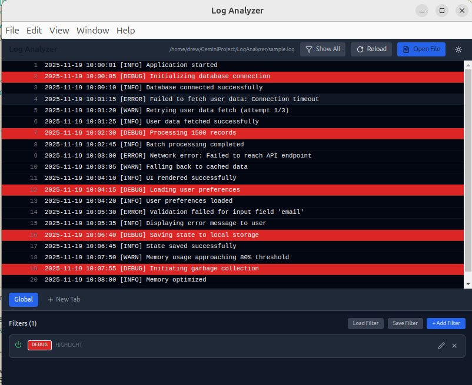
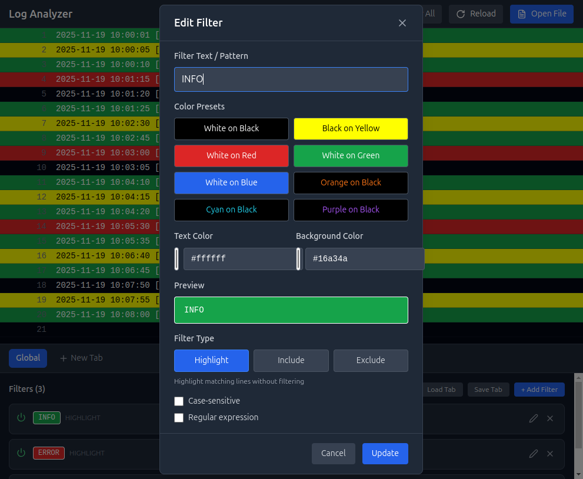

# Log Analyzer

A modern, high-performance desktop log analysis application built with Electron, React, TypeScript, and Tailwind CSS. This is a reimagined version of the classic "TextAnalysisTool.NET" with enhanced filter management capabilities and a sleek dark mode interface.


## ✨ Features

### 🚀 High-Performance Log Viewing
- **Virtualized rendering** using `react-virtuoso` - smoothly handle files with 100,000+ lines
- **Line numbers** for easy navigation
- **Modern dark theme** with customizable color highlights
- **Instant file reload** to monitor live log files

### 🎯 Advanced Filtering System
Three powerful filter types:
- **Highlight**: Colorize matching lines without hiding
- **Include**: Show ONLY lines that match the filter
- **Exclude**: Hide lines that match the filter

Filter options:
- ✅ Regular expression support
- ✅ Case-sensitive matching
- ✅ Custom text and background colors
- ✅ Color presets for quick setup
- ✅ Enable/disable filters on-the-fly

### 📑 Tabbed Filter Management (The Upgrade!)
- **Global tab**: Filters that apply across all views
- **Custom tabs**: Create multiple filter groups for different analysis scenarios
- **Tab management**: Create, rename, and delete tabs
- **Save/Load**: Export and import filter configurations as JSON
- **Visual filter cards** with inline editing

### 🔍 Smart View Modes
- **Show All**: Display all non-excluded lines (default)
- **Show Only Highlighted**: Focus on lines matching highlight filters
- **Status indicator**: See how many lines are visible vs total

## 📸 Screenshots

### Main Interface


The app features a split-pane layout with the log viewer on top and filter management at the bottom.

### Filter Modal


Create filters with an intuitive dialog featuring:
- Text/regex pattern input
- Color picker for text and background
- 8 preset color combinations
- Live preview of filter appearance
- Filter type selection (Highlight/Include/Exclude)

## 🛠️ Tech Stack

- **Electron** - Desktop application framework
- **React** - UI components
- **TypeScript** - Type-safe development
- **Tailwind CSS** - Utility-first styling
- **Zustand** - Lightweight state management
- **React Virtuoso** - Virtualized list rendering
- **Lucide React** - Modern icon library
- **Vite** - Fast build tool

## 📦 Installation

### Prerequisites
- Node.js 16+ and npm

### Setup
```bash
# Clone the repository
git clone git@github.com:hwanjongyu/LogAnalyzer.git
cd LogAnalyzer

# Install dependencies
npm install

# Run in development mode
npm run dev

# Build for production
npm run build
```

## 🚀 Usage

### Opening a Log File
1. Click **"Open File"** in the top menu bar
2. Select a `.log` or `.txt` file
3. The file will load and display in the viewer

### Creating Filters

#### Method 1: Using Presets
1. Click **"+ Add Filter"** in the filter panel
2. Enter your search text or regex pattern
3. Choose a color preset
4. Select filter type (Highlight/Include/Exclude)
5. Click **"Add Filter"**

#### Method 2: Custom Colors
1. Follow steps 1-2 above
2. Use the color pickers to choose custom text and background colors
3. Preview your filter in the preview box
4. Click **"Add Filter"**

### Working with Tabs
```
Global Tab (always active)
└── Applies to all views

Custom Tabs
├── "Errors Only" → Include filter for ERROR
├── "Network Logs" → Include filter for network.*
└── "Debug View" → Exclude filter for DEBUG
```

**To create a new tab:**
1. Click **"+ New Tab"** in the tab bar
2. Enter a name for your tab
3. Add filters specific to this view

**To save/load configurations:**
- Click **"Save Tab"** to export current tab filters to JSON
- Click **"Load Tab"** to import filters from a JSON file

### Filter Examples

**Show only errors:**
```
Type: Include
Pattern: ERROR
Colors: White on Red
```

**Hide debug logs:**
```
Type: Exclude
Pattern: \[DEBUG\]
Regex: ✓
```

**Highlight network requests:**
```
Type: Highlight
Pattern: (GET|POST|PUT|DELETE)
Regex: ✓
Colors: Cyan on Black
```

### Keyboard Shortcuts
- **ESC** - Close modal dialogs
- **Ctrl+R** - Reload current file (when file is open)

## 🗂️ Project Structure

```
LogAnalyzer/
├── electron/
│   ├── main.ts           # Main process & IPC handlers
│   └── preload.ts        # Context bridge
├── src/
│   ├── components/
│   │   ├── LogViewer.tsx      # Virtualized log display
│   │   ├── FilterManager.tsx  # Tab & filter management
│   │   └── FilterModal.tsx    # Filter creation dialog
│   ├── store/
│   │   └── useLogStore.ts     # Zustand store
│   ├── types/
│   │   ├── index.ts           # TypeScript types
│   │   └── electron.d.ts      # Electron API types
│   ├── lib/
│   │   └── utils.ts           # Utility functions
│   ├── App.tsx           # Main app component
│   └── main.tsx          # React entry point
├── sample.log            # Example log file
└── package.json
```

## 🔧 Development

### Available Scripts

```bash
# Start development server
npm run dev

# Build for production
npm run build

# Run linter
npm run lint

# Preview production build
npm run preview
```

### Adding New Features

1. **State Management**: Extend `src/store/useLogStore.ts`
2. **UI Components**: Add to `src/components/`
3. **Electron IPC**: Add handlers in `electron/main.ts`
4. **Types**: Update `src/types/index.ts`

## 📋 Filter Configuration Format

Filters are saved as JSON with the following structure:

```json
{
  "name": "Error Analysis",
  "filters": [
    {
      "id": "uuid",
      "text": "ERROR",
      "textColor": "#ffffff",
      "backgroundColor": "#dc2626",
      "type": "include",
      "caseSensitive": false,
      "isRegex": false,
      "enabled": true
    }
  ]
}
```

## 🤝 Contributing

Contributions are welcome! Please feel free to submit issues or pull requests.

## 📝 License

MIT License - feel free to use this project for personal or commercial purposes.

## 🙏 Acknowledgments

- Inspired by the classic [TextAnalysisTool.NET](https://github.com/TextAnalysisTool/Releases)
- Built with modern web technologies for enhanced performance and user experience

## 📧 Support

For questions or issues, please open an issue on GitHub.

---

**Made with ❤️ using Electron + React + TypeScript**
